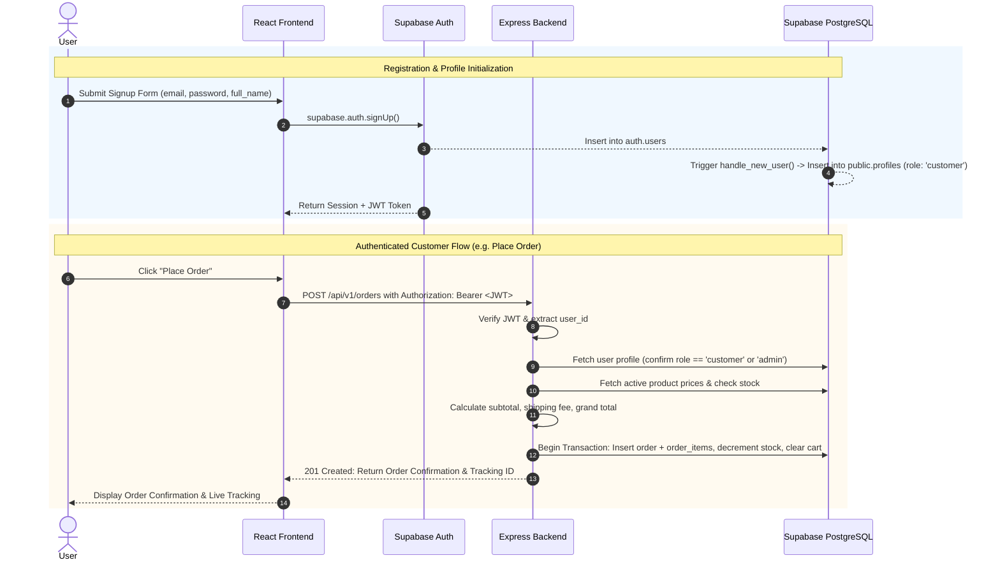

# FitBite Architecture Documentation

> **Document Version:** 1.0.0  
> **Target Stack:** React (Vite) + Node.js (Express) + Supabase (PostgreSQL)  
> **Status:** Architectural Reference (Phase 1 Workspace Initialization)

---

## 1. High-Level Architectural Flow

```
┌─────────────────────────────────────────────────────────┐
│                     React Frontend                      │
│                  (Vite SPA Client)                      │
│   • UI Views, Routing, State Management & Interactivity │
└────────────────────────────┬────────────────────────────┘
                             │
                             │ HTTPS / REST (JSON + JWT Bearer)
                             ▼
┌─────────────────────────────────────────────────────────┐
│                    Express REST API                     │
│                  (Node.js Backend)                      │
│   • Auth / RBAC Middleware, Validation, Business Logic   │
│   • Canonical Pricing, Inventory, & Order Processing    │
└────────────────────────────┬────────────────────────────┘
                             │
                             │ PostgreSQL / Supabase Admin SDK
                             ▼
┌─────────────────────────────────────────────────────────┐
│                   Supabase PostgreSQL                   │
│                    (Database Layer)                     │
│   • Normalized Tables, Constraints, Triggers, & RLS     │
└─────────────────────────────────────────────────────────┘
```

---

## 2. Layer Responsibilities

### 2.1 Frontend Layer (React + Vite)
- **Role:** Single Page Application (SPA) responsible for presentation, navigation, and user experience.
- **Key Responsibilities:**
  - Rendering responsive UI components using design tokens.
  - Client-side routing with `react-router-dom` (Public, Protected Customer, and Admin routes).
  - Managing application state (Auth, Cart, Wishlist, Notifications) with Context / Zustand.
  - Communicating with the Express backend via Axios / Fetch client with Bearer token authentication.
  - Optimistic UI updates for enhanced responsiveness.
  - Capturing and displaying form validation feedback to users.
- **Constraints:**
  - **Never perform canonical price or total calculations.**
  - **Never access database directly** for transaction-critical flows.
  - **Never contain server secrets.**

### 2.2 Backend Layer (Node.js + Express)
- **Role:** Centralized API Gateway, business logic controller, and security boundary.
- **Key Responsibilities:**
  - Authenticating requests via Supabase JWT verification middleware.
  - Enforcing Role-Based Access Control (RBAC) to separate `customer` and `admin` operations.
  - Validating and sanitizing all incoming payloads (using Zod or Joi).
  - Executing server-side business rules:
    - **Canonical Price Calculation:** Recomputing subtotal, taxes, shipping fees, and grand total directly from database records.
    - **Inventory Verification:** Confirming stock availability before order insertion and decrementing quantity atomically upon order placement.
    - **Order Lifecycle Management:** Managing order state transitions (`pending` → `processing` → `shipped` → `delivered` → `cancelled`).
  - Serving structured REST endpoints with standardized HTTP status codes and centralized error handling.

### 2.3 Database Layer (Supabase PostgreSQL)
- **Role:** Persistent, relational, ACID-compliant source of truth.
- **Key Responsibilities:**
  - Storing normalized entities (`profiles`, `categories`, `products`, `product_images`, `carts`, `cart_items`, `wishlists`, `wishlist_items`, `addresses`, `orders`, `order_items`, `reviews`).
  - Enforcing data integrity with primary keys, foreign keys, unique constraints, and check constraints.
  - Executing database triggers (such as `handle_new_user()` to auto-create user profiles upon auth signup).
  - Enforcing Row Level Security (RLS) policies as defense-in-depth protection.
  - Preserving historical pricing records in `order_items` independent of future product price changes.

---

## 3. Authentication & Authorization Flow



---

## 4. Customer vs. Admin Separation (RBAC)

| Capability / Resource | Customer Role | Admin Role | Enforced By |
|---|---|---|---|
| Browse Catalog & Search Products | Read Only | Read Only | Public Route / Express |
| Manage Personal Cart & Wishlist | Read / Write Own | Read / Write Own | Express Auth Middleware + RLS |
| Manage Saved Addresses | Read / Write Own | Read / Write Own | Express Auth Middleware + RLS |
| Place Orders & View Personal History | Own Orders Only | Own Orders Only | Express Service + RLS |
| Track Live Order Status | Own Orders Only | All Orders | Express Middleware + RLS |
| Create / Edit / Delete Products | **Forbidden (403)** | **Full Access** | Express `requireAdmin` Middleware |
| View All Customer Orders | **Forbidden (403)** | **Full Access** | Express `requireAdmin` Middleware |
| Update Order Fulfillment Status | **Forbidden (403)** | **Full Access** | Express `requireAdmin` Middleware |
| Store Metrics & Analytics | **Forbidden (403)** | **Full Access** | Express `requireAdmin` Middleware |

---

## 5. Security Principles & Credential Isolation

### 5.1 The Critical Rule of Server Credentials

> [!CAUTION]
> **`SUPABASE_SERVICE_ROLE_KEY` must NEVER be exposed to the frontend or bundled into client code.**

1. **Why the Anon Key is Safe for Clients:**
   - The `anon` key (`SUPABASE_ANON_KEY`) is a public credential designed for browser usage. It strictly obeys all PostgreSQL **Row Level Security (RLS)** policies. If RLS restricts a table to `auth.uid() = user_id`, an anon client cannot read other users' rows.
2. **Why the Service Role Key is Dangerous in Clients:**
   - The `service_role` key (`SUPABASE_SERVICE_ROLE_KEY`) is a superuser secret that **completely bypasses Row Level Security (RLS)**.
   - If leaked to the frontend, any user could view the entire user database, read all payment records, delete tables, or elevate their privileges to admin.
3. **Environment Variable Naming Standard:**
   - Client variables: Prefixed with `VITE_` (e.g., `VITE_API_BASE_URL`, `VITE_SUPABASE_URL`, `VITE_SUPABASE_ANON_KEY`).
   - Server variables: Unprefixed in `backend/.env` (e.g., `SUPABASE_SERVICE_ROLE_KEY`, `SUPABASE_JWT_SECRET`, `PORT`).

---

*This architecture document serves as the foundational design reference for all subsequent implementation phases.*
