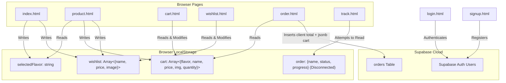
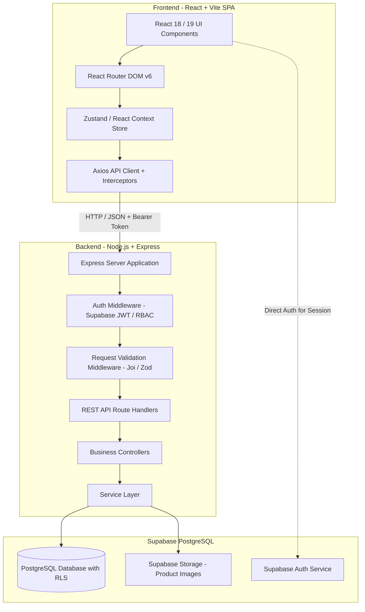
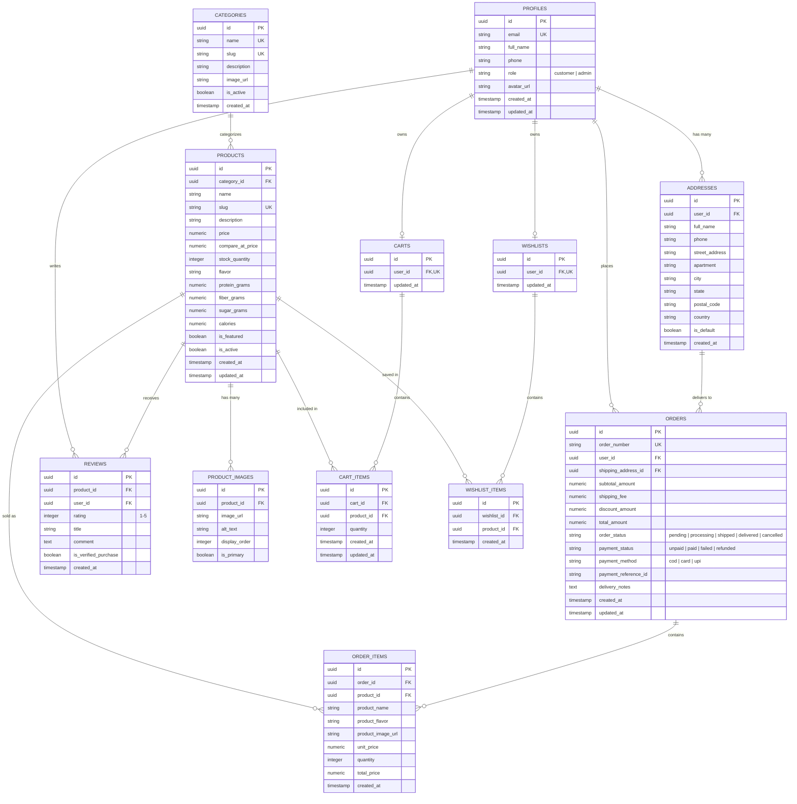

# FitBite Comprehensive Rebuild & Modernization Plan

> **Document Version:** 1.0.0  
> **Status:** Final Architectural Audit & Implementation Roadmap  
> **Project:** FitBite — Premium Protein & Fitness E-Commerce Platform  
> **Author:** Antigravity Engineering Team  

---

## Table of Contents

1. [Executive Summary](#1-executive-summary)
2. [Section 1: Exhaustive Analysis of Existing Project](#section-1-exhaustive-analysis-of-existing-project)
   - [1.1 Current Technology Stack](#11-current-technology-stack)
   - [1.2 File-by-File Codebase Audit](#12-file-by-file-codebase-audit)
   - [1.3 Git & Repository Configuration](#13-git--repository-configuration)
   - [1.4 State Management & Storage Analysis](#14-state-management--storage-analysis)
   - [1.5 Security Vulnerabilities & Architectural Flaws](#15-security-vulnerabilities--architectural-flaws)
   - [1.6 Code Duplication & Consistency Deficits](#16-code-duplication--consistency-deficits)
3. [Section 2: Current Feature Matrix & Status Classification](#section-2-current-feature-matrix--status-classification)
4. [Section 3: Existing Database & Supabase Audit](#section-3-existing-database--supabase-audit)
   - [3.1 Existing Schema & Tables](#31-existing-schema--tables)
   - [3.2 Critical Database Deficiencies](#32-critical-database-deficiencies)
5. [Section 4: Proposed Target Architecture](#section-4-proposed-target-architecture)
   - [4.1 High-Level Architecture Overview](#41-high-level-architecture-overview)
   - [4.2 Frontend Architecture (React + Vite)](#42-frontend-architecture-react--vite)
   - [4.3 Backend Architecture (Node.js + Express)](#43-backend-architecture-nodejs--express)
   - [4.4 Authentication & Role-Based Authorization (RBAC)](#44-authentication--role-based-authorization-rbac)
6. [Section 5: Proposed Normalized Database Schema](#section-5-proposed-normalized-database-schema)
   - [5.1 Entity Relationship Diagram (ERD)](#51-entity-relationship-diagram-erd)
   - [5.2 Detailed Table Specifications](#52-detailed-table-specifications)
   - [5.3 Row Level Security (RLS) & Triggers Policy](#53-row-level-security-rls--triggers-policy)
7. [Section 6: REST API Specification](#section-6-rest-api-specification)
8. [Section 7: Proposed Frontend Structure & UI Architecture](#section-7-proposed-frontend-structure--ui-architecture)
9. [Section 8: Migration & Asset Disposal Plan](#section-8-migration--asset-disposal-plan)
10. [Section 9: Phased 12-Stage Implementation Roadmap](#section-9-phased-12-stage-implementation-roadmap)
11. [Section 10: Verification, Testing & Production Readiness Standards](#section-10-verification-testing--production-readiness-standards)

---

## 1. Executive Summary

**FitBite** is an e-commerce web application for health-conscious consumers offering high-protein bars, fitness nutrition guides, and wellness content. 

The current codebase is a **prototype composed of static HTML files, inline CSS stylesheets, browser-side JavaScript modules, and direct browser-to-Supabase client calls**. While it demonstrates a solid brand concept and visual theme (warm caramel/earthy tones), it lacks the architecture, security, relational data modeling, backend validation, administrative workflows, and state synchronization required for a professional, production-grade web application.

This plan details the full transition from the legacy multi-page static site to an **enterprise-grade, decoupled full-stack architecture** powered by:
- **Frontend:** React 18 / 19 + Vite + React Router + Lucide Icons + Modern CSS Design System
- **Backend:** Node.js + Express.js + RESTful Controller/Service/Repository layer + Joi/Zod validation + JWT/Supabase Auth middleware
- **Database:** PostgreSQL on Supabase with normalized tables, foreign key constraints, triggers, indexes, and Row-Level Security (RLS)
- **Role-Based Access Control (RBAC):** Customer and Admin tiers

---

## Section 1: Exhaustive Analysis of Existing Project

### 1.1 Current Technology Stack

| Layer | Current Implementation | Assessment |
|---|---|---|
| **Frontend UI** | Static HTML5 (14 standalone `.html` files) | Obsolete multi-page structure, high DOM re-render overhead, no code sharing |
| **Styling** | Inline `<style>` tags in every HTML file | Severe duplication, inconsistent color tokens, lack of unified CSS variables |
| **Icons & Fonts** | FontAwesome 6 (CDNJS), Google Fonts (Poppins / Segoe UI) | Inconsistent font choices across pages |
| **Clientside Scripting** | Vanilla JS `<script>` & `<script type="module">` via ESM CDN | Untyped, unbundled, vulnerable to script injection & runtime errors |
| **Client SDK** | `@supabase/supabase-js` loaded via jsDelivr CDN (`+esm`) | Hardcoded project URL and public anon key in `supabaseClient.js` |
| **Backend Server** | **None** | All operations run directly in user's browser |
| **Database** | Supabase PostgreSQL (`vlshgyqlptiihqmdbkzr`) | Only 1 active table (`orders`) with denormalized JSONB cart storage |
| **Auth** | Supabase Auth (Email + Password) | Fragile client-side checks; DOM toggling via CSS class `.hidden` |
| **Build Tools** | None (Raw file execution / Live Server) | No minification, bundling, linting, testing, or tree-shaking |

### 1.2 File-by-File Codebase Audit

#### 1. `supabaseClient.js`
- **Purpose:** Initializes and exports the Supabase client instance.
- **Code:**
  ```javascript
  import { createClient } from 'https://cdn.jsdelivr.net/npm/@supabase/supabase-js/+esm'
  const supabaseUrl = 'https://vlshgyqlptiihqmdbkzr.supabase.co'
  const supabaseAnonKey = 'eyJhbGciOiJIUzI1NiIsInR5cCI6IkpXVCJ9...'
  export const supabase = createClient(supabaseUrl, supabaseAnonKey)
  ```
- **Issues:**
  - Credentials are in source control without `.env` isolation.
  - Relies on external CDN availability; breaks if CDN is blocked or offline.

#### 2. `index.html` (1,148 lines)
- **Purpose:** Landing page with Hero, Brand Story, Flavors grid, Benefits, Customer Reviews, Top Search with suggestions, and Footer.
- **Functionality:**
  - `checkAuth()` runs `supabase.auth.getUser()` to toggle user login link vs logout button.
  - Search suggestion filter operates on hardcoded in-memory array `products = [{name, flavor}, ...]`.
  - `addToWishlist()` saves `{name, price, image}` to `localStorage.getItem('wishlist')`.
  - `addToCart()` only alerts the user and redirects to `product.html`.
  - `viewProduct(flavor)` sets `localStorage.setItem('selectedFlavor', flavor)` and redirects.
- **Issues:**
  - 700+ lines of inline CSS.
  - Product data is hardcoded and out of sync with other pages.
  - Add to cart does not actually add items from the homepage.

#### 3. `product.html` (339 lines)
- **Purpose:** Product detail page.
- **Functionality:**
  - Reads `localStorage.getItem('selectedFlavor')` to index into a hardcoded JS object: `chocolate`, `berry`, `almond`, `peanut`.
  - Calculates dynamic price based on quantity stepper.
  - `addToCart()` appends/increments item in `localStorage.getItem('cart')`.
  - `addToWishlistDetail()` appends item to `localStorage.getItem('wishlist')`.
- **Issues:**
  - If a user opens `product.html` directly or refreshes with no `selectedFlavor` in storage, product information is empty and image fails to load (`images/default.jpg` which does not exist in repository).
  - No database lookup; products cannot be dynamically created, updated, or have inventory managed.

#### 4. `cart.html` (555 lines)
- **Purpose:** Shopping cart page.
- **Functionality:**
  - Async session check via `supabase.auth.getUser()`. If no user, renders a "Login Required to View Cart" block.
  - Reads cart from `localStorage.getItem('cart')`.
  - Supports quantity adjustments (`changeQuantity`) and item deletion (`removeItem`).
  - Calculates Subtotal, Flat Shipping (₹50 if Subtotal <= ₹500, Free if > ₹500), and Total.
- **Issues:**
  - Cart data is tied to the local device browser rather than user account database.
  - Cart calculations are purely client-side and can be tampered with.

#### 5. `wishlist.html` (351 lines)
- **Purpose:** Saved items page.
- **Functionality:**
  - Auth protection via `supabase.auth.getUser()`.
  - Reads `localStorage.getItem('wishlist')`.
  - Renders grid of saved items with "Remove" buttons.
- **Issues:**
  - Fallback mockup data is hardcoded if localStorage parsing fails.
  - Cannot move items directly from Wishlist to Cart.
  - Wishlist is lost if user clears browser cache or changes device.

#### 6. `order.html` (312 lines)
- **Purpose:** Checkout and Order placement page.
- **Functionality:**
  - Auth check via `supabase.auth.getUser()`.
  - Loads cart items from `localStorage`.
  - Form gathers `name`, `address`, `contact`, and `payment` (COD, Card, UPI).
  - Form submit inserts directly into Supabase table `orders`:
    ```javascript
    const orderDetails = {
      user_id: user.id,
      full_name: document.getElementById('name').value,
      delivery_address: document.getElementById('address').value,
      contact_number: document.getElementById('contact').value,
      payment_method: document.getElementById('payment').value,
      items: cart, // Entire cart array stored as JSON
      total_amount: total // Client-calculated total!
    };
    await supabase.from('orders').insert([orderDetails]);
    ```
- **Critical Security Flaw:**
  - The client calculates `total_amount` and submits it. Any user can alter prices in local storage or the DOM console and place orders for ₹0.
  - No payment gateway integration (Razorpay, Stripe, etc.); selecting "Card" or "UPI" immediately places an unpaid order as "Pending".
  - Stores entire cart as unstructured `jsonb` array rather than relational `order_items`.

#### 7. `track.html` (100 lines)
- **Purpose:** Order tracking page.
- **Functionality:**
  - Attempts to read `localStorage.getItem('order')` for `{ name, status, progress }`.
  - Renders an animated progress bar based on percentage.
- **Issues:**
  - **Completely Broken/Disconnected:** `order.html` writes to Supabase and clears `cart`, but never sets `localStorage.setItem('order', ...)`. Thus, `track.html` always says "No orders to track".
  - Does not query Supabase `orders` table.

#### 8. `login.html` (123 lines) & `signup.html` (136 lines)
- **Purpose:** Authentication pages.
- **Functionality:**
  - `signup.html` calls `supabase.auth.signUp({ email, password, options: { data: { full_name } } })`.
  - `login.html` calls `supabase.auth.signInWithPassword({ email, password })`.
- **Issues:**
  - No password complexity enforcement or inline form validation (only standard HTML5 attributes).
  - No error toast notification system (uses primitive `alert()`).
  - No "Forgot Password" or "Reset Password" workflows.
  - No profile creation in a relational `profiles` table.

#### 9. Informational Pages (`nutrition.html`, `receipes.html`, `fitnesstips.html`, `faq.html`, `support.html`)
- **Purpose:** Content and wellness resources.
- **Issues:**
  - Static hardcoded content.
  - Inconsistent layouts, font stacks, and back buttons.
  - `receipes.html` filename has a typo (`receipes` vs `recipes`).
  - FAQ accordion scripts are replicated across `faq.html` and `support.html`.

#### 10. Assets in `images/`
- Contains: `logo.jpeg`, `choco-almond.jpeg`, `peanut-fudge.jpeg`, `berry-blast.jpeg`, `caramel-coffee.jpeg`, `protein-combo.jpeg`, `protein.jpeg`, `shop.jpeg`, `benefits.jpeg`.
- **Issues:** Missing `default.jpg` referenced as fallback in `product.html` and `order.html`. All images are uncompressed JPEGs.

### 1.3 Git & Repository Configuration

- **Repository Origin:** `https://github.com/Deeksha534/Fitbite.git`
- **Active Branch:** `main`
- **Commit History:** 10+ historical commits primarily modifying `order.html`, `index.html`, and adding informational pages.
- **Missing Files:**
  - No `.gitignore` (exposes system files, `.env`, and future `node_modules`).
  - No `package.json` or dependency manifest.
  - No `README.md` documentation.
  - No ESLint, Prettier, or TypeScript configurations.

### 1.4 State Management & Storage Analysis



### 1.5 Security Vulnerabilities & Architectural Flaws

1. **Tamperable Order Pricing:** Subtotal and total calculations happen exclusively in clientside JS. A user can inject any `total_amount` value directly into the Supabase query.
2. **Missing Backend Validation:** No server-side sanitization of delivery addresses, telephone numbers, or injection vectors.
3. **Hardcoded Credentials:** Anon key and URL are directly committed in JS client.
4. **No Role-Based Authorization:** No admin concept. Any authenticated user is just a generic auth account.
5. **No Stock / Inventory Validation:** Orders can be placed for out-of-stock items or arbitrary quantities because inventory is neither tracked nor decremented.
6. **Denormalized Order Items:** Orders table stores products as raw JSON strings. If a product price or name changes in the future, past order auditing is compromised; conversely, product queries and sales reporting are impossible to run via SQL aggregations.

### 1.6 Code Duplication & Consistency Deficits

- 14 separate `<style>` tags with recurring CSS definitions.
- Header and navigation markup copied across 7+ files with different links and missing icons.
- Color palette drift (`#d2a679` vs `#C8946E` vs `#C6966A` vs `#b37a4c`).
- Inconsistent auth session handling and redirects across pages.

---

## Section 2: Current Feature Matrix & Status Classification

| Feature | Implementation Classification | Current Mechanism | Critical Deficiencies |
|---|---|---|---|
| **User Registration** | Fully implemented | Supabase Auth (`signUp`) | No profile table record, no field validation |
| **User Login** | Fully implemented | Supabase Auth (`signInWithPassword`) | No persistent state store, alert popups |
| **User Logout** | Partially implemented | Supabase Auth (`signOut`) | Only present on `index.html` navbar |
| **Role-Based Auth** | **Missing** | None | No Admin vs Customer concept |
| **Product Browsing** | Mock / Static | Hardcoded HTML & JS dictionaries | Not database-backed; only 4 flavors |
| **Product Details** | Partially implemented | `product.html` + `localStorage` | Breaks on direct URL visit or page reload |
| **Product Search** | Mock / Static | Inline JS filtering on 4 items | Static array; limited match fields |
| **Shopping Cart** | LocalStorage-based | `localStorage.getItem('cart')` | Lost across devices; no DB sync |
| **Cart Quantity Controls** | LocalStorage-based | JS array mutation in memory | No stock limits enforced |
| **Wishlist** | LocalStorage-based | `localStorage.getItem('wishlist')` | No move-to-cart; not synced to account |
| **Checkout & Order Creation**| Partially implemented / Insecure | Direct client insert to `orders` | Client-set price; no payment gateway |
| **Order Tracking** | Broken / Incomplete | `track.html` reads `localStorage` | Not connected to Supabase orders; displays dummy state |
| **Order History** | **Missing** | None | Users cannot view past orders |
| **Admin Dashboard** | **Missing** | None | No way to view orders, update status, manage products |
| **Nutrition Guide** | Mock / Static | Static HTML (`nutrition.html`) | Not dynamic or searchable |
| **Fitness Tips** | Mock / Static | Static HTML (`fitnesstips.html`) | Static cards |
| **Recipes** | Mock / Static | Static HTML (`receipes.html`) | Typo in filename; static cards |
| **FAQ & Support** | Mock / Static | Static HTML (`faq.html`, `support.html`) | Duplicated FAQ logic |

---

## Section 3: Existing Database & Supabase Audit

### 3.1 Existing Schema & Tables

Based on inspection of `supabaseClient.js`, `order.html`, `signup.html`, and `track.html`:

#### 1. Table: `orders` (Active)
| Column | Inferred Type | Constraint / Note |
|---|---|---|
| `id` | `uuid` or `bigint` | Primary Key (Default Supabase auto-gen) |
| `user_id` | `uuid` | References `auth.users.id` |
| `full_name` | `text` | Customer full name |
| `delivery_address`| `text` | Unstructured address string |
| `contact_number` | `text` | Customer phone number |
| `payment_method` | `text` | 'cod', 'card', 'upi' |
| `items` | `jsonb` | Unstructured array of cart items |
| `total_amount` | `numeric` | Total cost calculated by client |
| `status` | `text` | Default: 'Pending' |
| `created_at` | `timestamptz` | Auto-generated timestamp |

#### 2. Authentication: `auth.users`
- Managed internally by Supabase Auth.
- Metadata stores `full_name`.

### 3.2 Critical Database Deficiencies

1. **No Products Table:** Products are not in the database. Adding a new protein bar requires editing HTML and JavaScript files.
2. **No Categories Table:** Cannot categorize by Bars, Powders, Bundles, Vegan, Gluten-free, etc.
3. **No Profiles Table:** User profile data is trapped inside Supabase Auth metadata and cannot be easily joined or assigned roles.
4. **No Normalized `order_items` Table:** Cannot execute queries such as "Top 5 selling protein bars" or "Revenue by flavor".
5. **No Historical Pricing Preservation:** If product prices change, storing item snapshots in `jsonb` lacks schema enforcement and referential integrity.
6. **No Cart / Wishlist Persistence:** Cloud carts for logged-in users do not exist.
7. **No Addresses Table:** Customers must type their entire address on every checkout.
8. **No RLS Verification:** Without verified RLS policies on the `orders` table, any user with the anon key can read all customer addresses and telephone numbers.

---

## Section 4: Proposed Target Architecture

### 4.1 High-Level Architecture Overview



### 4.2 Frontend Architecture (React + Vite)
- **Framework:** React with Vite for rapid HMR and optimized production builds.
- **Routing:** `react-router-dom` with Public, Protected (Customer), and Admin Route Guards.
- **State Management:**
  - **Auth State:** React Context / Zustand for session token, user profile, and user role.
  - **Cart & Wishlist State:** Synchronized state (Local cache with optimistic DB sync).
  - **Server Cache / Query:** Clean API service layer with Axios interceptors.
- **Design System:** Modular Vanilla CSS / CSS Modules with curated CSS custom properties (Design Tokens for colors, typography, elevations, spacing, and micro-interactions).
- **Icons:** `lucide-react` for modern, clean iconography.

### 4.3 Backend Architecture (Node.js + Express)
- **Directory Structure:**
  ```
  backend/
  ├── config/             # Environment, Supabase admin client, constants
  ├── controllers/        # Request/response logic
  ├── middleware/         # Auth, RBAC, error handler, validation, rate limiter
  ├── routes/             # Express route declarations
  ├── services/           # Database queries, business logic, calculations
  ├── validators/         # Input schemas (Zod / Joi)
  └── server.js           # Entry point & app setup
  ```
- **Security:**
  - Helmet for HTTP headers
  - CORS configured for frontend domain
  - Express Rate Limiting on auth and order endpoints
  - Centralized Error Handling middleware

### 4.4 Authentication & Role-Based Authorization (RBAC)
- **Roles:**
  - `customer`: Browse, manage personal cart/wishlist, place orders, view personal order history, update personal profile/address.
  - `admin`: Full customer capabilities + Manage product catalog (CRUD), view all store orders, update fulfillment status, view analytics/metrics, manage categories.
- **Token Verification:**
  - Frontend sends Supabase JWT in `Authorization: Bearer <token>` header.
  - Backend verifies token via Supabase Admin SDK / JWT secret and extracts `user_id`.
  - Backend queries `profiles.role` to enforce role guards.

---

## Section 5: Proposed Normalized Database Schema

### 5.1 Entity Relationship Diagram (ERD)



### 5.2 Detailed Table Specifications

#### 1. `profiles`
- **Purpose:** Extends `auth.users` with application-specific metadata and RBAC roles.
- **Columns:**
  - `id` (UUID, PK, References `auth.users(id)` ON DELETE CASCADE)
  - `email` (TEXT, NOT NULL, UNIQUE)
  - `full_name` (TEXT)
  - `phone` (TEXT)
  - `role` (TEXT, NOT NULL, DEFAULT 'customer', CHECK (`role` IN ('customer', 'admin')))
  - `avatar_url` (TEXT)
  - `created_at` (TIMESTAMPTZ, DEFAULT NOW())
  - `updated_at` (TIMESTAMPTZ, DEFAULT NOW())

#### 2. `categories`
- **Purpose:** Groups products (e.g., Protein Bars, Energy Bites, Starter Bundles, Vegan Series).
- **Columns:**
  - `id` (UUID, PK, DEFAULT gen_random_uuid())
  - `name` (TEXT, NOT NULL, UNIQUE)
  - `slug` (TEXT, NOT NULL, UNIQUE)
  - `description` (TEXT)
  - `image_url` (TEXT)
  - `is_active` (BOOLEAN, DEFAULT true)
  - `created_at` (TIMESTAMPTZ, DEFAULT NOW())

#### 3. `products`
- **Purpose:** Core catalog entity storing pricing, nutrition, and inventory.
- **Columns:**
  - `id` (UUID, PK, DEFAULT gen_random_uuid())
  - `category_id` (UUID, FK -> `categories(id)` ON DELETE SET NULL)
  - `name` (TEXT, NOT NULL)
  - `slug` (TEXT, NOT NULL, UNIQUE)
  - `description` (TEXT)
  - `price` (NUMERIC(10,2), NOT NULL, CHECK (`price` >= 0))
  - `compare_at_price` (NUMERIC(10,2), CHECK (`compare_at_price` >= `price`))
  - `stock_quantity` (INTEGER, NOT NULL, DEFAULT 0, CHECK (`stock_quantity` >= 0))
  - `flavor` (TEXT)
  - `protein_grams` (NUMERIC(5,1), DEFAULT 0)
  - `fiber_grams` (NUMERIC(5,1), DEFAULT 0)
  - `sugar_grams` (NUMERIC(5,1), DEFAULT 0)
  - `calories` (INTEGER, DEFAULT 0)
  - `is_featured` (BOOLEAN, DEFAULT false)
  - `is_active` (BOOLEAN, DEFAULT true)
  - `created_at` (TIMESTAMPTZ, DEFAULT NOW())
  - `updated_at` (TIMESTAMPTZ, DEFAULT NOW())

#### 4. `product_images`
- **Purpose:** Multiple images per product.
- **Columns:**
  - `id` (UUID, PK, DEFAULT gen_random_uuid())
  - `product_id` (UUID, NOT NULL, FK -> `products(id)` ON DELETE CASCADE)
  - `image_url` (TEXT, NOT NULL)
  - `alt_text` (TEXT)
  - `display_order` (INTEGER, DEFAULT 0)
  - `is_primary` (BOOLEAN, DEFAULT false)

#### 5. `carts` & `cart_items`
- **Purpose:** Persistent server-side cart for logged-in users.
- **`carts` Columns:**
  - `id` (UUID, PK, DEFAULT gen_random_uuid())
  - `user_id` (UUID, NOT NULL, UNIQUE, FK -> `profiles(id)` ON DELETE CASCADE)
  - `updated_at` (TIMESTAMPTZ, DEFAULT NOW())
- **`cart_items` Columns:**
  - `id` (UUID, PK, DEFAULT gen_random_uuid())
  - `cart_id` (UUID, NOT NULL, FK -> `carts(id)` ON DELETE CASCADE)
  - `product_id` (UUID, NOT NULL, FK -> `products(id)` ON DELETE CASCADE)
  - `quantity` (INTEGER, NOT NULL, DEFAULT 1, CHECK (`quantity` > 0))
  - `created_at` (TIMESTAMPTZ, DEFAULT NOW())
  - `updated_at` (TIMESTAMPTZ, DEFAULT NOW())
  - *Unique Constraint:* `UNIQUE(cart_id, product_id)`

#### 6. `wishlists` & `wishlist_items`
- **Purpose:** Persistent saved items per customer.
- **`wishlists` Columns:**
  - `id` (UUID, PK, DEFAULT gen_random_uuid())
  - `user_id` (UUID, NOT NULL, UNIQUE, FK -> `profiles(id)` ON DELETE CASCADE)
  - `updated_at` (TIMESTAMPTZ, DEFAULT NOW())
- **`wishlist_items` Columns:**
  - `id` (UUID, PK, DEFAULT gen_random_uuid())
  - `wishlist_id` (UUID, NOT NULL, FK -> `wishlists(id)` ON DELETE CASCADE)
  - `product_id` (UUID, NOT NULL, FK -> `products(id)` ON DELETE CASCADE)
  - `created_at` (TIMESTAMPTZ, DEFAULT NOW())
  - *Unique Constraint:* `UNIQUE(wishlist_id, product_id)`

#### 7. `addresses`
- **Purpose:** Customer shipping addresses with default address flag.
- **Columns:**
  - `id` (UUID, PK, DEFAULT gen_random_uuid())
  - `user_id` (UUID, NOT NULL, FK -> `profiles(id)` ON DELETE CASCADE)
  - `full_name` (TEXT, NOT NULL)
  - `phone` (TEXT, NOT NULL)
  - `street_address` (TEXT, NOT NULL)
  - `apartment` (TEXT)
  - `city` (TEXT, NOT NULL)
  - `state` (TEXT, NOT NULL)
  - `postal_code` (TEXT, NOT NULL)
  - `country` (TEXT, NOT NULL, DEFAULT 'India')
  - `is_default` (BOOLEAN, DEFAULT false)
  - `created_at` (TIMESTAMPTZ, DEFAULT NOW())

#### 8. `orders` & `order_items`
- **Purpose:** Canonical order tracking and immutable historical transaction records.
- **`orders` Columns:**
  - `id` (UUID, PK, DEFAULT gen_random_uuid())
  - `order_number` (TEXT, NOT NULL, UNIQUE) -- e.g., 'FB-2026-1001'
  - `user_id` (UUID, NOT NULL, FK -> `profiles(id)` ON DELETE RESTRICT)
  - `shipping_address_id` (UUID, FK -> `addresses(id)` ON DELETE SET NULL)
  - `shipping_address_snapshot` (JSONB, NOT NULL) -- Preserves address at time of order
  - `subtotal_amount` (NUMERIC(10,2), NOT NULL, CHECK (`subtotal_amount` >= 0))
  - `shipping_fee` (NUMERIC(10,2), NOT NULL, DEFAULT 0, CHECK (`shipping_fee` >= 0))
  - `discount_amount` (NUMERIC(10,2), NOT NULL, DEFAULT 0, CHECK (`discount_amount` >= 0))
  - `total_amount` (NUMERIC(10,2), NOT NULL, CHECK (`total_amount` >= 0))
  - `order_status` (TEXT, NOT NULL, DEFAULT 'pending', CHECK (`order_status` IN ('pending', 'processing', 'shipped', 'delivered', 'cancelled')))
  - `payment_status` (TEXT, NOT NULL, DEFAULT 'unpaid', CHECK (`payment_status` IN ('unpaid', 'paid', 'failed', 'refunded')))
  - `payment_method` (TEXT, NOT NULL, CHECK (`payment_method` IN ('cod', 'card', 'upi')))
  - `payment_reference_id` (TEXT)
  - `delivery_notes` (TEXT)
  - `created_at` (TIMESTAMPTZ, DEFAULT NOW())
  - `updated_at` (TIMESTAMPTZ, DEFAULT NOW())
- **`order_items` Columns (Historical Pricing Preservation):**
  - `id` (UUID, PK, DEFAULT gen_random_uuid())
  - `order_id` (UUID, NOT NULL, FK -> `orders(id)` ON DELETE CASCADE)
  - `product_id` (UUID, FK -> `products(id)` ON DELETE SET NULL)
  - `product_name` (TEXT, NOT NULL) -- Captured at purchase time
  - `product_flavor` (TEXT)
  - `product_image_url` (TEXT)
  - `unit_price` (NUMERIC(10,2), NOT NULL, CHECK (`unit_price` >= 0)) -- Captured price!
  - `quantity` (INTEGER, NOT NULL, CHECK (`quantity` > 0))
  - `total_price` (NUMERIC(10,2), NOT NULL, CHECK (`total_price` >= 0))
  - `created_at` (TIMESTAMPTZ, DEFAULT NOW())

#### 9. `reviews`
- **Purpose:** Customer product reviews and ratings.
- **Columns:**
  - `id` (UUID, PK, DEFAULT gen_random_uuid())
  - `product_id` (UUID, NOT NULL, FK -> `products(id)` ON DELETE CASCADE)
  - `user_id` (UUID, NOT NULL, FK -> `profiles(id)` ON DELETE CASCADE)
  - `rating` (INTEGER, NOT NULL, CHECK (`rating` BETWEEN 1 AND 5))
  - `title` (TEXT)
  - `comment` (TEXT)
  - `is_verified_purchase` (BOOLEAN, DEFAULT false)
  - `created_at` (TIMESTAMPTZ, DEFAULT NOW())
  - *Unique Constraint:* `UNIQUE(product_id, user_id)`

### 5.3 Row Level Security (RLS) & Triggers Policy

1. **Auto-Profile Trigger on User Signup:**
   - PostgreSQL function `handle_new_user()` executes `AFTER INSERT ON auth.users`.
   - Automatically populates `public.profiles` with `id`, `email`, and `full_name` from metadata.
2. **RLS Policies:**
   - `profiles`: Users can read and update their own profile. Admins can read all profiles.
   - `products` & `categories`: Public can READ active records. Only `admin` role can INSERT, UPDATE, DELETE.
   - `carts` & `cart_items`: Users can only access their own cart.
   - `wishlists` & `wishlist_items`: Users can only access their own wishlist.
   - `addresses`: Users can CRUD their own addresses.
   - `orders` & `order_items`: Users can SELECT their own orders. Admins can SELECT and UPDATE all orders.

---

## Section 6: REST API Specification

All backend endpoints are prefixed with `/api/v1`.

### 6.1 Authentication & Profile (`/api/v1/auth`, `/api/v1/users`)
- `POST /auth/register` — Validates inputs, creates user via Supabase Admin, creates initial profile.
- `POST /auth/login` — Verifies credentials, returns session & role metadata.
- `GET /auth/me` — Fetches current authenticated user profile + role.
- `PUT /users/profile` — Updates full name, phone number, avatar.
- `PUT /users/password` — Updates account password securely.

### 6.2 Products & Categories (`/api/v1/products`, `/api/v1/categories`)
- `GET /products` — Query products with pagination (`?page=1&limit=12`), filtering (`?category=bars&flavor=chocolate`), sorting (`?sort=price_asc`), and search (`?q=almond`).
- `GET /products/featured` — Returns featured items for homepage carousel/grid.
- `GET /products/:slug` — Returns single product details with nutritional facts, gallery images, and reviews.
- `GET /categories` — Returns list of all active categories.

### 6.3 Cart Management (`/api/v1/cart`)
- `GET /cart` — Returns current user's cart with calculated subtotal, discounts, and real-time inventory validation.
- `POST /cart/items` — Adds an item to cart `{ productId, quantity }`.
- `PUT /cart/items/:itemId` — Updates quantity of a specific cart item.
- `DELETE /cart/items/:itemId` — Removes an item from cart.
- `DELETE /cart/clear` — Empties cart.
- `POST /cart/merge` — Merges guest/localStorage cart into DB cart upon login.

### 6.4 Wishlist (`/api/v1/wishlist`)
- `GET /wishlist` — Returns user's saved wishlist items.
- `POST /wishlist/items` — Adds product to wishlist `{ productId }`.
- `DELETE /wishlist/items/:productId` — Removes product from wishlist.
- `POST /wishlist/move-to-cart/:productId` — Moves item from wishlist to cart.

### 6.5 Customer Addresses (`/api/v1/addresses`)
- `GET /addresses` — Returns list of customer's saved addresses.
- `POST /addresses` — Adds a new shipping address.
- `PUT /addresses/:id` — Updates existing address.
- `DELETE /addresses/:id` — Deletes address.
- `PATCH /addresses/:id/default` — Sets address as default.

### 6.6 Orders & Checkout (`/api/v1/orders`)
- `POST /orders` — **Server-Calculated Checkout:**
  - Validates all cart items, prices, and stock availability from DB.
  - Computes subtotal, shipping fee, discount, and grand total on the backend.
  - Creates record in `orders` and multiple records in `order_items`.
  - Atomically decrements `stock_quantity` in `products`.
  - Clears user's cart.
  - Returns created order details and tracking reference.
- `GET /orders` — Returns paginated order history for logged-in user.
- `GET /orders/:id` (or `:orderNumber`) — Returns order details, item breakdown, shipping address snapshot, and tracking status timeline.
- `POST /orders/:id/cancel` — Allows customer cancellation if status is still 'pending'.

### 6.7 Admin Management (`/api/v1/admin`)
- `GET /admin/dashboard/stats` — Total sales, order volume, low-stock alerts, customer count.
- `GET /admin/products` — Admin view of all products (including inactive/out-of-stock).
- `POST /admin/products` — Creates a new product with image uploads.
- `PUT /admin/products/:id` — Updates product pricing, stock, description, nutritional data.
- `DELETE /admin/products/:id` — Soft-deletes or archives product.
- `GET /admin/orders` — Paginated list of all customer orders with filters (`status`, `date`, `customer`).
- `PATCH /admin/orders/:id/status` — Updates status (`pending` -> `processing` -> `shipped` -> `delivered` -> `cancelled`).
- `GET /admin/customers` — Lists all registered customers and order frequency.

### 6.8 Content & Reviews (`/api/v1/reviews`, `/api/v1/content`)
- `GET /products/:productId/reviews` — Returns verified reviews for a product.
- `POST /products/:productId/reviews` — Submits review (guarded: must be authenticated buyer).
- `GET /content/recipes` — Returns healthy fitness recipes.
- `GET /content/fitness-tips` — Returns fitness tips and nutrition articles.

---

## Section 7: Proposed Frontend Structure & UI Architecture

### 7.1 Directory Layout (`frontend/src/`)

```
frontend/
├── public/
│   ├── favicon.ico
│   └── images/               # Brand & product assets
├── src/
│   ├── assets/               # SVGs, animations
│   ├── components/
│   │   ├── admin/            # Admin table, modal, product editor, status pill
│   │   ├── common/           # Button, Input, Modal, Badge, Toast, Loader, Dropdown
│   │   ├── feedback/         # ReviewCard, RatingStars, Alert
│   │   ├── layout/           # Navbar, Footer, TopBar, AdminLayout, Sidebar
│   │   ├── product/          # ProductCard, ProductGrid, FlavorBadge, PriceTag
│   │   └── cart/             # CartItemRow, CartSummary, QuantityStepper
│   ├── context/              # AuthContext, CartContext, WishlistContext, ToastContext
│   ├── hooks/                # useAuth, useCart, useWishlist, useDebounce, useProducts
│   ├── layouts/              # MainLayout, AuthLayout, AdminLayout, DashboardLayout
│   ├── pages/
│   │   ├── public/           # Home, Products, ProductDetail, Nutrition, Recipes, Tips, FAQ, Support
│   │   ├── auth/             # Login, Signup, ForgotPassword
│   │   ├── customer/         # Cart, Wishlist, Checkout, OrderSuccess, OrderHistory, OrderTracking, Profile
│   │   └── admin/            # AdminDashboard, AdminProducts, AdminOrders, AdminProductForm
│   ├── routes/               # AppRoutes, ProtectedRoute, AdminRoute
│   ├── services/             # api.js, authService, productService, orderService, cartService
│   ├── styles/               # tokens.css, reset.css, global.css, components/
│   ├── utils/                # formatters (currency, date), validators, storage
│   ├── App.jsx
│   └── main.jsx
├── index.html
├── package.json
└── vite.config.js
```

### 7.2 Core Pages Specification

1. **Public Pages:**
   - **`HomePage` (`/`):** Dynamic Hero with seasonal banner, Featured Protein Bars, Interactive Nutrition macro highlights, Real customer testimonials carousel, Newsletter signup.
   - **`ProductsPage` (`/products`):** Full product catalog with filter sidebar (Flavor, Protein Range, Price, Diet: Vegan/Keto), search input with debounce, sort dropdown.
   - **`ProductDetailPage` (`/products/:slug`):** Image gallery, Flavor selector, Nutrition macro pill badges (Protein, Carbs, Fat, Fiber), Quantity selector, Add to Cart & Add to Wishlist buttons, Verified customer reviews with star rating breakdown.
   - **`NutritionGuidePage` (`/nutrition`):** Interactive macro calculator, healthy eating guide, visual diet plates.
   - **`RecipesPage` (`/recipes`):** Filterable healthy protein snack recipes with ingredient lists and step-by-step guides.
   - **`FitnessTipsPage` (`/fitness-tips`):** Workout recovery articles, hydration tips, muscle repair advice.
   - **`FAQPage` (`/faq`):** Category-based searchable FAQ accordion.
   - **`SupportPage` (`/support`):** Contact form, direct email/phone cards, ticket submission.

2. **Authentication Pages:**
   - **`LoginPage` (`/login`):** Glassmorphic card, email/password validation, remember me, link to signup.
   - **`SignupPage` (`/signup`):** Full name, email, password strength meter, confirm password.

3. **Customer Authenticated Pages:**
   - **`CartPage` (`/cart`):** Live item list, real-time stock status, coupon discount input, free-shipping progress meter, summary breakdown.
   - **`WishlistPage` (`/wishlist`):** Grid of saved items with 1-click "Move to Cart" and "Remove".
   - **`CheckoutPage` (`/checkout`):** 3-step checkout: (1) Select/Add Delivery Address, (2) Payment Method (COD, Card, UPI), (3) Review & Place Order.
   - **`OrderConfirmationPage` (`/order-success/:orderNumber`):** Summary receipt, estimated delivery date, direct link to live tracking.
   - **`OrderTrackingPage` (`/orders/:orderNumber/track`):** Dynamic 4-stage visual timeline (Order Placed -> Processing -> Shipped -> Out for Delivery -> Delivered) backed by real database order state.
   - **`OrderHistoryPage` (`/account/orders`):** Customer's past orders with order status badge, re-order button, invoice download.
   - **`ProfilePage` (`/account/profile`):** Personal details, saved delivery addresses manager, password change.

4. **Admin Authenticated Pages:**
   - **`AdminDashboardPage` (`/admin`):** Sales metrics (Revenue, Orders, Low Stock Items), recent orders table.
   - **`AdminProductsPage` (`/admin/products`):** Product catalog table with Stock level badges, Price, Actions (Edit, Deactivate, Delete).
   - **`AdminProductEditorPage` (`/admin/products/new`, `/admin/products/:id/edit`):** Form for name, slug, price, macros, inventory, category, and image uploads.
   - **`AdminOrdersPage` (`/admin/orders`):** All orders filterable by status; modal to advance status (`Pending` -> `Processing` -> `Shipped` -> `Delivered`).

---

## Section 8: Migration & Asset Disposal Plan

### 8.1 Files to be Replaced (Legacy Prototype)

| Existing File | Future Replacement | Rationale |
|---|---|---|
| `index.html` (root) | `frontend/src/pages/public/HomePage.jsx` | Replaced by dynamic React component tree |
| `product.html` | `frontend/src/pages/public/ProductDetailPage.jsx` | Dynamic route `/products/:slug` fetching from API |
| `cart.html` | `frontend/src/pages/customer/CartPage.jsx` | Integrated with `useCart` store & backend sync |
| `wishlist.html` | `frontend/src/pages/customer/WishlistPage.jsx` | Integrated with `useWishlist` store & DB sync |
| `order.html` | `frontend/src/pages/customer/CheckoutPage.jsx` | Multi-step checkout with backend pricing validation |
| `track.html` | `frontend/src/pages/customer/OrderTrackingPage.jsx` | Real database-backed timeline querying `/api/v1/orders/:id` |
| `login.html` | `frontend/src/pages/auth/LoginPage.jsx` | React form with state, validation, and redirect |
| `signup.html` | `frontend/src/pages/auth/SignupPage.jsx` | React form with password meter and profile init |
| `nutrition.html` | `frontend/src/pages/public/NutritionGuidePage.jsx` | Reusable React component with responsive layout |
| `receipes.html` | `frontend/src/pages/public/RecipesPage.jsx` | Fixes filename typo; component with search/filter |
| `fitnesstips.html` | `frontend/src/pages/public/FitnessTipsPage.jsx` | Clean React component |
| `faq.html` | `frontend/src/pages/public/FAQPage.jsx` | Reusable accordion component |
| `support.html` | `frontend/src/pages/public/SupportPage.jsx` | Modern contact form component |
| `supabaseClient.js` | `frontend/src/services/supabase.js` & `backend/config/supabase.js` | Environment-variable driven clients |

### 8.2 Assets to Retain and Optimize

- **`images/logo.jpeg`** -> Optimize and export as PNG/WebP for high-DPI displays.
- **`images/choco-almond.jpeg`** -> Seed into `products` database table for Chocolate Almond Crunch.
- **`images/peanut-fudge.jpeg`** -> Seed into `products` database table for Peanut Butter Fudge.
- **`images/berry-blast.jpeg`** -> Seed into `products` database table for Berry Blast.
- **`images/caramel-coffee.jpeg`** -> Seed into `products` database table for Caramel Coffee Delight.
- **`images/protein-combo.jpeg`** -> Seed as bundle hero graphic.
- **`images/protein.jpeg`** -> Optimize for nutrition guide banner.
- **`images/shop.jpeg`** -> Optimize for promotional hero ad.
- **`images/benefits.jpeg`** -> Optimize for benefits section.

---

## Section 9: Phased 12-Stage Implementation Roadmap

```mermaid
gantt
    title FitBite 12-Phase Implementation Roadmap
    dateFormat  YYYY-MM-DD
    section Foundation
    Phase 1: Project Setup & Monorepo Structure    :p1, 2026-09-01, 2d
    Phase 2: Database Schema & Migration Scripts   :p2, after p1, 3d
    Phase 3: Backend Core & REST API               :p3, after p2, 4d
    section Core Features
    Phase 4: Frontend Scaffolding & Design System  :p4, after p3, 3d
    Phase 5: Auth & Role-Based Access Control      :p5, after p4, 3d
    Phase 6: Products, Catalog & Search            :p6, after p5, 3d
    Phase 7: Persistent Cart & Wishlist Sync       :p7, after p6, 3d
    Phase 8: Checkout, Orders & Real Tracking      :p8, after p7, 4d
    section Advanced & Delivery
    Phase 9: Admin Dashboard & Product Management  :p9, after p8, 4d
    Phase 10: Security Hardening & Automated Tests :p10, after p9, 3d
    Phase 11: Deployment & CI/CD Pipeline          :p11, after p10, 2d
    Phase 12: Documentation & Portfolio Polish     :p12, after p11, 2d
```

### Phase 1 — Project Setup & Workspace Organization
1. Establish clean directory layout:
   ```
   FitBite/
   ├── backend/
   ├── frontend/
   ├── database/
   └── .gitignore
   ```
2. Initialize root `.gitignore` to protect `.env`, `node_modules`, and build artifacts.
3. Configure `package.json` for frontend (Vite + React) and backend (Express).
4. Create environment variable templates (`.env.example`).

### Phase 2 — Database Schema & Migration Scripts
1. Create SQL migration scripts for all normalized tables:
   - `profiles`, `categories`, `products`, `product_images`, `carts`, `cart_items`, `wishlists`, `wishlist_items`, `addresses`, `orders`, `order_items`, `reviews`.
2. Configure Row Level Security (RLS) policies for every table.
3. Set up the `handle_new_user()` trigger for automated profile creation.
4. Prepare seed data script (`seeds.sql`) containing initial categories, the 4 existing protein bar products with nutritional facts, pricing, stock levels, and admin profile credentials.

### Phase 3 — Backend Core & REST API
1. Build Express server foundation with CORS, Helmet, and JSON parsing.
2. Implement Supabase Admin SDK integration.
3. Build auth & RBAC middleware (`verifyAuth`, `requireAdmin`).
4. Build Request Validation middleware with Zod/Joi schemas.
5. Implement controllers and services for Products, Categories, Cart, Wishlist, Addresses, and Orders.
6. Implement centralized error handling middleware.

### Phase 4 — Frontend Scaffolding & Design System
1. Initialize Vite + React project.
2. Establish Design Token system in `tokens.css` (Colors: caramel, espresso, cream, warm amber; Typography: Poppins / Inter; Spacing; Shadow elevations).
3. Build reusable UI components: `Button`, `Input`, `Card`, `Badge`, `Modal`, `Toast`, `Spinner`, `RatingStars`.
4. Build responsive `MainLayout` (Sticky TopBar, Header, Navigation links, Footer with newsletter).

### Phase 5 — Authentication & Customer Profile
1. Implement `AuthContext` managing Supabase auth session, JWT tokens, and user profile.
2. Build `LoginPage` and `SignupPage` with validation and error toasts.
3. Implement `ProtectedRoute` for customer pages and `AdminRoute` for admin panel.
4. Build `ProfilePage` and `AddressManager` component.

### Phase 6 — Product Catalog, Search & Nutrition
1. Build `HomePage` with dynamic Hero, Featured Products, Benefits, and Testimonials.
2. Build `ProductsPage` with search debounce, category filter, flavor filter, and price sort.
3. Build `ProductDetailPage` with gallery, macro nutritional badges, quantity stepper, and reviews.
4. Build Content Pages: `NutritionGuidePage`, `RecipesPage`, `FitnessTipsPage`, `FAQPage`, `SupportPage`.

### Phase 7 — Persistent Cart & Wishlist
1. Build `CartContext` and `WishlistContext`.
2. Implement optimistic UI updates with automatic backend synchronization.
3. Build `CartPage` with item quantity adjustments, item removal, and free shipping progress meter.
4. Build `WishlistPage` with 1-click "Move to Cart" action.
5. Implement guest-to-authenticated cart merging upon login.

### Phase 8 — Checkout, Orders & Real Order Tracking
1. Build `CheckoutPage`:
   - Step 1: Select or enter delivery address.
   - Step 2: Select payment method (COD, Mock Card, UPI).
   - Step 3: Server-side pricing validation and order confirmation.
2. Build `OrderConfirmationPage` (`/order-success/:orderNumber`).
3. Build `OrderHistoryPage` displaying customer's past orders with status pills.
4. Build `OrderTrackingPage` querying live order status with an animated 4-stage tracking timeline.

### Phase 9 — Admin Dashboard & Store Management
1. Build `AdminLayout` with sidebar navigation.
2. Build `AdminDashboardPage` with real-time revenue cards, order count, and low-stock alerts.
3. Build `AdminProductsPage` with table view, search, stock badges, and create/edit modal.
4. Build `AdminOrdersPage` with status update dropdown (`Pending` -> `Processing` -> `Shipped` -> `Delivered`).

### Phase 10 — Security Hardening & Testing
1. Conduct security audit:
   - Verify all order totals are strictly server-computed.
   - Confirm RLS blocks unauthorized access across users.
   - Confirm Admin routes reject non-admin JWTs with 403 Forbidden.
   - Implement rate limiting on sensitive API endpoints.
2. Write integration tests for API endpoints (Auth, Products, Cart, Orders).
3. Test responsive UI across mobile, tablet, and desktop breakpoints.

### Phase 11 — Production Deployment Preparation
1. Configure frontend production build optimization (chunk splitting, image compression).
2. Configure backend environment variable validation.
3. Setup Vercel / Netlify configuration for Frontend SPA routing (`_redirects` / `vercel.json`).
4. Setup Render / Railway / Supabase Edge configuration for Backend.

### Phase 12 — Documentation & Portfolio Polish
1. Write comprehensive `README.md` with:
   - Architecture diagram
   - Tech stack badges
   - Local setup guide (`npm run dev`)
   - API documentation table
   - Database ERD
   - Screenshots of customer and admin interfaces.
2. Archive or safely remove deprecated legacy HTML files while preserving full git commit history.

---

## Section 10: Verification, Testing & Production Readiness Standards

### 10.1 Automated Verification Plan

| Category | Test Case | Target Metric |
|---|---|---|
| **Auth** | Registration, Login, Token Refresh, Invalid Credentials | 100% pass, secure HTTP-only / bearer token validation |
| **RBAC** | Customer attempting to access `/api/v1/admin/*` | Returns `403 Forbidden` |
| **Pricing Integrity** | Checkout with modified payload price in request body | Server recalculates and rejects/overrides with DB price |
| **Inventory** | Order quantity exceeding `stock_quantity` | Returns `400 Bad Request: Insufficient Stock` |
| **Stock Deduction** | Successful order placement | `stock_quantity` accurately decremented in database |
| **Cart Sync** | Add items as guest -> Login | Guest items merged into user's DB cart |
| **Tracking** | Advance order status via Admin | Customer tracking timeline updates in real-time |

### 10.2 Manual User Flow Verification Checklist
1. **New Customer Flow:** Visit homepage -> Search "Peanut" -> View Peanut Butter Fudge detail -> Add 2 items to cart -> Add 1 item to wishlist -> Register account -> Checkout with COD -> View Order Confirmation -> Check Order Tracking timeline.
2. **Returning Customer Flow:** Login -> View past order history in profile -> Add item from wishlist to cart -> Modify quantity -> Complete checkout.
3. **Admin Flow:** Login with Admin account -> Access `/admin` -> Check store metrics -> Add a new product (e.g. "Vanilla Almond Whey Bar") -> Update an existing order status from "Processing" to "Shipped" -> Verify customer sees "Shipped" on their tracking page.

---

*End of Rebuild Plan. Do not modify existing files or execute migrations until explicit approval is provided.*
