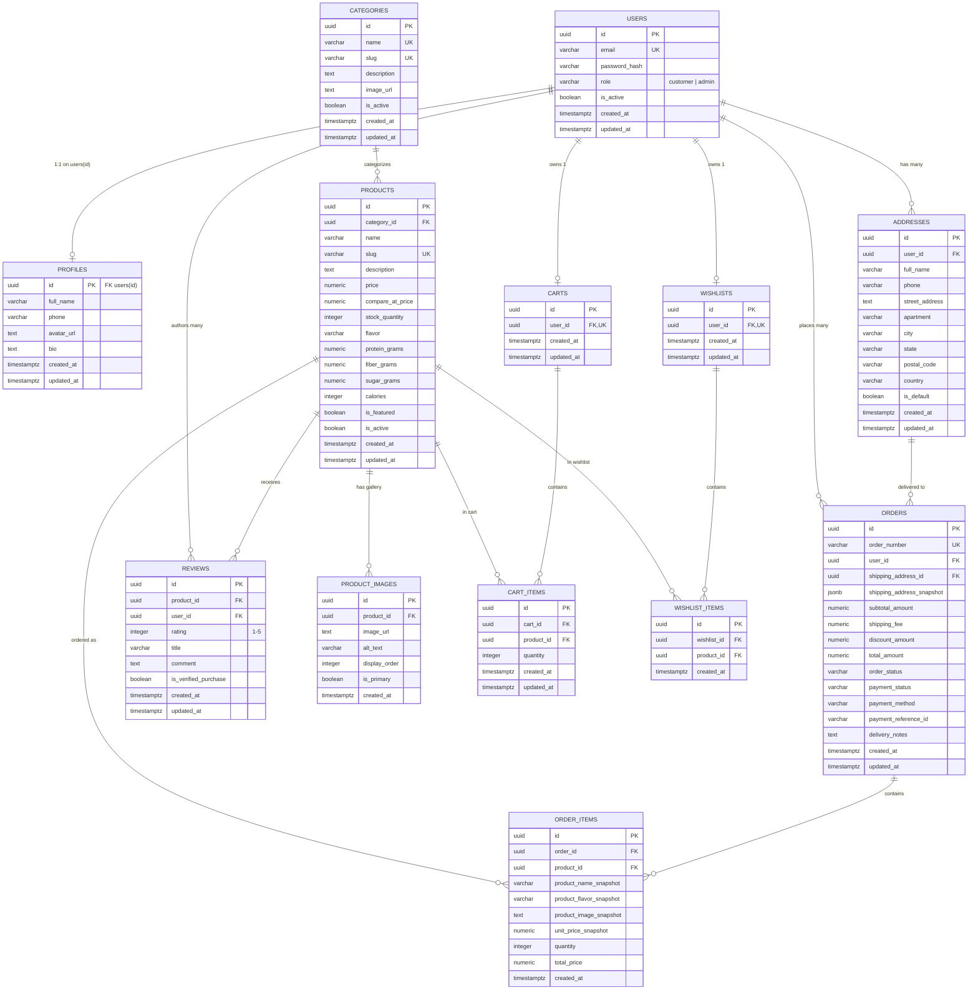
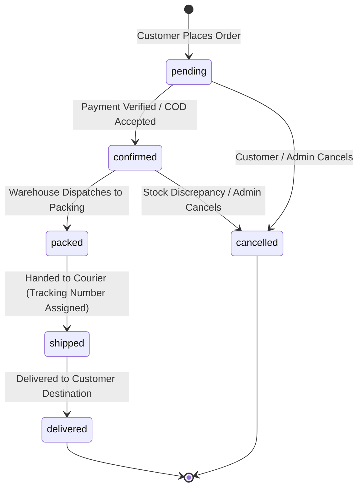

# FitBite Database Architecture & Schema Documentation

> **Database Engine:** Standard PostgreSQL 14+ (Provider-Independent)  
> **Schema Version:** 2.1.0 (Standard PostgreSQL + Express REST Architecture)  
> **Status:** Local Schema Definition & Migration Catalog (Phase 2)

---

## 1. Entity Relationship Diagram (ERD)



---

## 2. Table Specifications & Constraints Matrix

| Table Name | Primary Key | Foreign Keys & Actions | Key Constraints |
|---|---|---|---|
| **`users`** | `id` (UUID) | None | `UNIQUE(email)`, `CHECK (role IN ('customer', 'admin'))`, `is_active` |
| **`profiles`** | `id` (UUID) | `id -> users(id)` `ON DELETE CASCADE` | 1:1 user profile metadata |
| **`categories`** | `id` (UUID) | None | `UNIQUE(name)`, `UNIQUE(slug)` |
| **`products`** | `id` (UUID) | `category_id -> categories(id)` `ON DELETE SET NULL` | `UNIQUE(slug)`, `CHECK(price >= 0)`, `CHECK(compare_at_price >= price)`, `CHECK(stock_quantity >= 0)` |
| **`product_images`** | `id` (UUID) | `product_id -> products(id)` `ON DELETE CASCADE` | None |
| **`carts`** | `id` (UUID) | `user_id -> users(id)` `ON DELETE CASCADE` | `UNIQUE(user_id)` (1 cart per user) |
| **`cart_items`** | `id` (UUID) | `cart_id -> carts(id)` `ON DELETE CASCADE`, `product_id -> products(id)` `ON DELETE CASCADE` | `UNIQUE(cart_id, product_id)`, `CHECK(quantity > 0)` |
| **`wishlists`** | `id` (UUID) | `user_id -> users(id)` `ON DELETE CASCADE` | `UNIQUE(user_id)` (1 wishlist per user) |
| **`wishlist_items`** | `id` (UUID) | `wishlist_id -> wishlists(id)` `ON DELETE CASCADE`, `product_id -> products(id)` `ON DELETE CASCADE` | `UNIQUE(wishlist_id, product_id)` |
| **`addresses`** | `id` (UUID) | `user_id -> users(id)` `ON DELETE CASCADE` | Single default address enforced via trigger |
| **`orders`** | `id` (UUID) | `user_id -> users(id)` `ON DELETE RESTRICT`, `shipping_address_id -> addresses(id)` `ON DELETE SET NULL` | `UNIQUE(order_number)`, `CHECK(order_status IN ('pending', 'confirmed', 'packed', 'shipped', 'delivered', 'cancelled'))`, `CHECK(payment_status IN ('unpaid', 'paid', 'failed', 'refunded'))`, `CHECK(payment_method IN ('cod', 'card', 'upi'))` |
| **`order_items`** | `id` (UUID) | `order_id -> orders(id)` `ON DELETE CASCADE`, `product_id -> products(id)` `ON DELETE SET NULL` | `CHECK(quantity > 0)`, `CHECK(unit_price_snapshot >= 0)` |
| **`reviews`** | `id` (UUID) | `product_id -> products(id)` `ON DELETE CASCADE`, `user_id -> users(id)` `ON DELETE CASCADE` | `UNIQUE(product_id, user_id)` (1 review per product per user), `CHECK(rating BETWEEN 1 AND 5)` |

---

## 3. Historical Pricing & Snapshot Architecture

### Why Snapshot Columns are Essential in E-Commerce
In a naive schema, order items join live against the `products` and `addresses` tables. This causes critical business errors:
1. **Price Alteration Bug:** If an item is purchased for ₹120 and the store later increases the price to ₹150, re-rendering an old receipt dynamically from `products.price` would incorrectly display ₹150.
2. **Product Deletion/Renaming Bug:** If a flavor is renamed or discontinued, old invoices break or become unreadable.
3. **Address Drift:** If a customer moves and updates their saved address, past deliveries would show the wrong historical destination.

### FitBite Snapshot Implementation
- **`orders.shipping_address_snapshot` (`jsonb`):** Freezes the exact full name, phone number, street address, city, state, and postal code at the instant of order placement.
- **`order_items.unit_price_snapshot` (`numeric`):** Freezes the exact unit cost paid.
- **`order_items.product_name_snapshot` (`varchar`):** Freezes the exact product title.
- **`order_items.product_flavor_snapshot` (`varchar`):** Freezes the exact flavor variation.
- **`order_items.product_image_snapshot` (`text`):** Freezes the product thumbnail for customer invoice rendering.

---

## 4. Controlled Order Lifecycle



---

## 5. Security & Authorization Architecture

### Standard Backend Authentication & Authorization Model
Rather than relying on proprietary database-level RLS, authorization is enforced in the **Node.js / Express** application layer:

```
Incoming Request
      ↓
authenticateToken Middleware (Verifies JWT via JWT_SECRET)
      ↓ (Sets req.user = { id, email, role })
requireAdmin Middleware (If route is admin-only; checks role === 'admin')
      ↓
Controller / Service Layer (Queries PostgreSQL with Parameterized SQL)
      ↓
PostgreSQL Returns Authoritative Data
```

---

## 6. Migration Execution Order

When running migrations against standard PostgreSQL, execute files in sequential numerical order:

```text
database/migrations/
├── 001_create_extensions_and_helpers.sql   # uuid-ossp, pgcrypto, set_updated_at()
├── 002_create_users.sql                    # users authentication credentials table
├── 003_create_profiles.sql                 # profiles linked to users(id)
├── 004_create_categories.sql               # categories
├── 005_create_products_and_images.sql      # products & product_images
├── 006_create_carts_and_items.sql          # carts & cart_items
├── 007_create_wishlists_and_items.sql      # wishlists & wishlist_items
├── 008_create_addresses.sql                # customer shipping addresses
├── 009_create_orders_and_items.sql         # orders & immutable order_items
├── 010_create_reviews.sql                  # customer reviews & ratings
├── 011_create_triggers.sql                 # default address handler, updated_at maintenance
└── 012_create_indexes.sql                  # Performance B-tree indexes
```

### Seed Data Execution Order

```text
database/seed/
├── 001_seed_categories.sql                 # Core product categories
├── 002_seed_products.sql                   # 4 core bars + Summer Starter Pack + images
└── 003_seed_sample_data.sql                # Dev test users (admin + customer) & reviews
```

---

*End of Database Documentation.*
