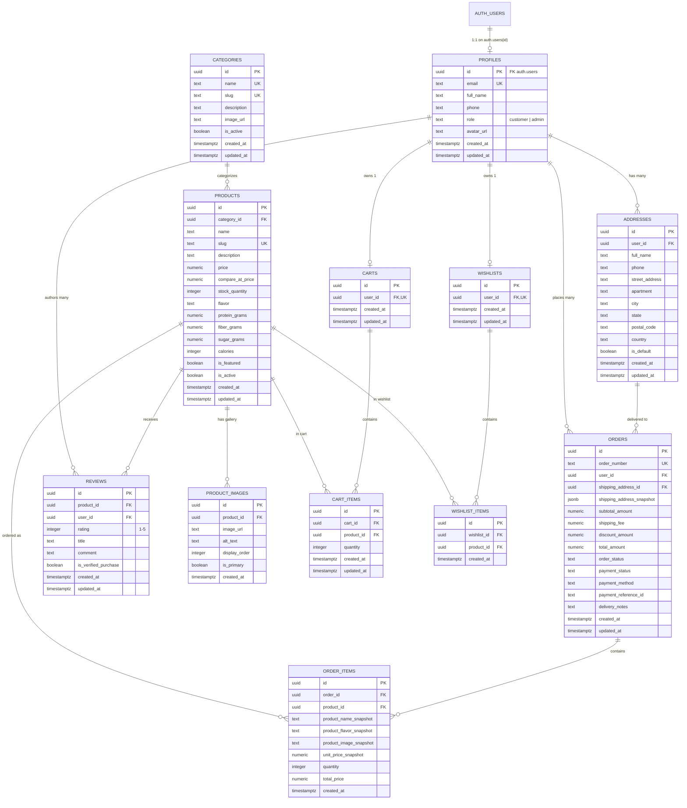
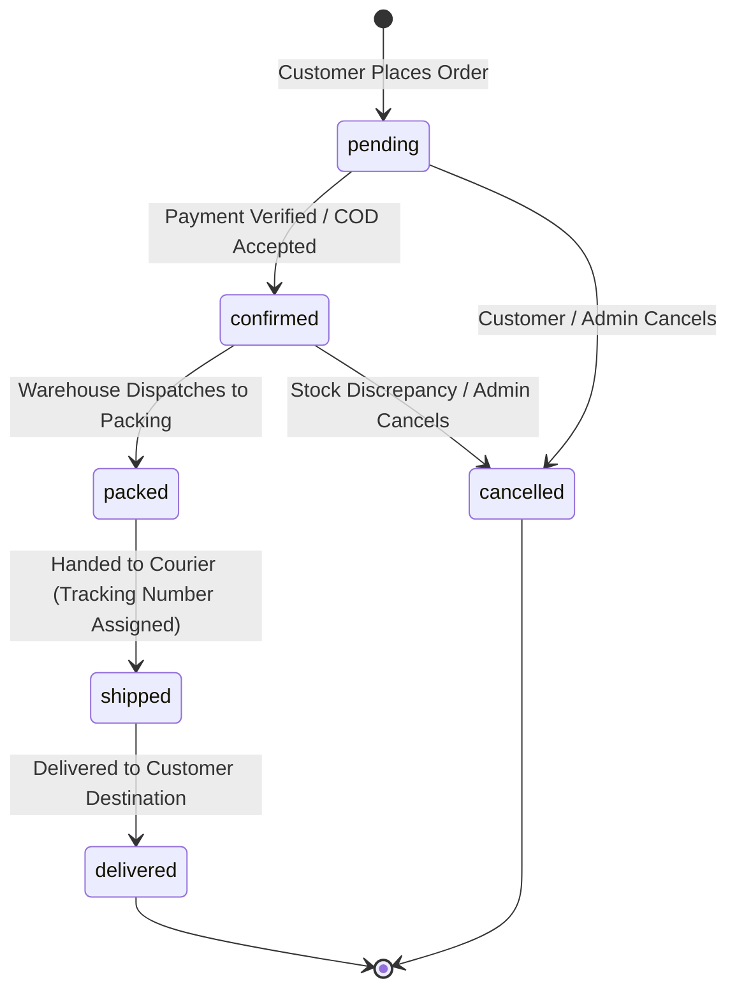

# FitBite Database Architecture & Schema Documentation

> **Database Engine:** PostgreSQL 15+ (Hosted via Supabase)  
> **Schema Version:** 2.0.0 (Normalized Production Schema)  
> **Status:** Local Schema Definition & Migration Catalog (Phase 2)

---

## 1. Entity Relationship Diagram (ERD)



---

## 2. Table Specifications & Constraints Matrix

| Table Name | Primary Key | Foreign Keys & Actions | Key Constraints |
|---|---|---|---|
| **`profiles`** | `id` (UUID) | `id -> auth.users(id)` `ON DELETE CASCADE` | `UNIQUE(email)`, `CHECK (role IN ('customer', 'admin'))` |
| **`categories`** | `id` (UUID) | None | `UNIQUE(name)`, `UNIQUE(slug)` |
| **`products`** | `id` (UUID) | `category_id -> categories(id)` `ON DELETE SET NULL` | `UNIQUE(slug)`, `CHECK(price >= 0)`, `CHECK(compare_at_price >= price)`, `CHECK(stock_quantity >= 0)` |
| **`product_images`** | `id` (UUID) | `product_id -> products(id)` `ON DELETE CASCADE` | None |
| **`carts`** | `id` (UUID) | `user_id -> profiles(id)` `ON DELETE CASCADE` | `UNIQUE(user_id)` (1 cart per user) |
| **`cart_items`** | `id` (UUID) | `cart_id -> carts(id)` `ON DELETE CASCADE`, `product_id -> products(id)` `ON DELETE CASCADE` | `UNIQUE(cart_id, product_id)`, `CHECK(quantity > 0)` |
| **`wishlists`** | `id` (UUID) | `user_id -> profiles(id)` `ON DELETE CASCADE` | `UNIQUE(user_id)` (1 wishlist per user) |
| **`wishlist_items`** | `id` (UUID) | `wishlist_id -> wishlists(id)` `ON DELETE CASCADE`, `product_id -> products(id)` `ON DELETE CASCADE` | `UNIQUE(wishlist_id, product_id)` |
| **`addresses`** | `id` (UUID) | `user_id -> profiles(id)` `ON DELETE CASCADE` | Single default address enforced via trigger |
| **`orders`** | `id` (UUID) | `user_id -> profiles(id)` `ON DELETE RESTRICT`, `shipping_address_id -> addresses(id)` `ON DELETE SET NULL` | `UNIQUE(order_number)`, `CHECK(order_status IN ('pending', 'confirmed', 'packed', 'shipped', 'delivered', 'cancelled'))`, `CHECK(payment_status IN ('unpaid', 'paid', 'failed', 'refunded'))`, `CHECK(payment_method IN ('cod', 'card', 'upi'))` |
| **`order_items`** | `id` (UUID) | `order_id -> orders(id)` `ON DELETE CASCADE`, `product_id -> products(id)` `ON DELETE SET NULL` | `CHECK(quantity > 0)`, `CHECK(unit_price_snapshot >= 0)` |
| **`reviews`** | `id` (UUID) | `product_id -> products(id)` `ON DELETE CASCADE`, `user_id -> profiles(id)` `ON DELETE CASCADE` | `UNIQUE(product_id, user_id)` (1 review per product per user), `CHECK(rating BETWEEN 1 AND 5)` |

---

## 3. Historical Pricing & Snapshot Strategy

### Why Snapshot Columns are Critical in E-Commerce
In a naive schema, order items join live against the `products` and `addresses` tables. This causes two severe real-world bugs:
1. **Price Alteration Bug:** If an item is purchased for ₹120 and the store later increases the price to ₹150, re-rendering an old invoice dynamically from `products.price` would incorrectly claim the customer paid ₹150.
2. **Product Deletion/Renaming Bug:** If a flavor is renamed or discontinued, old receipts break or become unreadable.
3. **Address Drift:** If a customer moves and updates their profile address, past deliveries would show the wrong historical destination.

### FitBite Snapshot Implementation
- **`orders.shipping_address_snapshot` (`jsonb`):** Freezes the exact full name, phone number, street address, city, state, and postal code at the instant of order placement.
- **`order_items.unit_price_snapshot` (`numeric`):** Freezes the exact unit cost paid.
- **`order_items.product_name_snapshot` (`text`):** Freezes the exact product title.
- **`order_items.product_flavor_snapshot` (`text`):** Freezes the exact flavor variation.
- **`order_items.product_image_snapshot` (`text`):** Freezes the product thumbnail for customer invoice rendering.

---

## 4. Controlled Order Lifecycle



---

## 5. Security & Row Level Security (RLS) Policy Guide

### 5.1 RBAC Enforcement
- Roles are defined as `customer` (default) and `admin`.
- The `profiles` table has a `BEFORE UPDATE OF role` trigger (`prevent_role_escalation`) that rejects any attempt by a non-admin client to elevate their own role.
- Helper function `public.is_admin()` checks admin status inside PostgreSQL with `SECURITY DEFINER` privileges.

### 5.2 RLS Policy Overview

| Table | Public Access | Customer Access | Admin Access |
|---|---|---|---|
| `profiles` | None | Read / Update own profile (`auth.uid() = id`) | Read / Update all profiles |
| `categories` | Read Active (`is_active = true`) | Read Active | Full CRUD |
| `products` | Read Active (`is_active = true`) | Read Active | Full CRUD |
| `product_images` | Read All | Read All | Full CRUD |
| `carts` & `cart_items` | None | Full CRUD for own cart (`user_id = auth.uid()`) | Full Access |
| `wishlists` & `items` | None | Full CRUD for own wishlist (`user_id = auth.uid()`) | Full Access |
| `addresses` | None | Full CRUD for own addresses (`user_id = auth.uid()`) | Full Access |
| `orders` & `items` | None | Read own orders; Cancel if `pending` | Full CRUD across all store orders |
| `reviews` | Read All | Create / Update / Delete own reviews | Moderate / Delete any review |

---

## 6. Migration Execution Order

When applying migrations in Supabase or a local PostgreSQL instance, execute the files in sequential numerical order:

```text
database/migrations/
├── 001_create_extensions_and_helpers.sql   # uuid-ossp, pgcrypto, set_updated_at(), is_admin()
├── 002_create_profiles.sql                 # profiles linked to auth.users
├── 003_create_categories.sql               # categories
├── 004_create_products_and_images.sql      # products & product_images
├── 005_create_carts_and_items.sql          # carts & cart_items
├── 006_create_wishlists_and_items.sql      # wishlists & wishlist_items
├── 007_create_addresses.sql                # customer shipping addresses
├── 008_create_orders_and_items.sql         # orders & immutable order_items
├── 009_create_reviews.sql                  # customer reviews & ratings
├── 010_create_triggers.sql                 # auto-profile on signup, address default handler
├── 011_create_rls_policies.sql             # Row Level Security policies
└── 012_create_indexes.sql                  # Performance B-tree indexes
```

### Seed Data Execution Order

```text
database/seed/
├── 001_seed_categories.sql                 # Core product categories
├── 002_seed_products.sql                   # 4 core bars + Summer Starter Pack + images
└── 003_seed_sample_data.sql                # Initial reviews & admin elevation guide
```

---

## 7. Compatibility with Existing Legacy Database

### Comparison of Legacy vs. New Architecture

| Dimension | Legacy Prototype | New Normalized Schema | Migration / Compatibility Action |
|---|---|---|---|
| **Orders Storage** | Single `orders` table storing `items` as raw `jsonb` | Normalized `orders` + `order_items` tables | New checkout will write normalized records. Legacy JSONB orders can be queried or migrated with an adapter script. |
| **Address Storage** | Raw string inside `orders.delivery_address` | Normalized `addresses` table + `shipping_address_snapshot` (`jsonb`) | New checkout saves user addresses and generates the frozen snapshot automatically. |
| **Product Source** | Hardcoded in `index.html` and `product.html` | Relational `products` & `categories` tables | Seeded with exact legacy product names, macros, flavors, and pricing in `002_seed_products.sql`. |
| **Cart & Wishlist** | `localStorage` strings on individual browsers | Relational `carts`, `cart_items`, `wishlists`, `wishlist_items` | Seamless DB sync with guest fallback. |
| **User Roles** | No roles (all users identical) | `profiles.role` (`customer`, `admin`) with RLS enforcement | `010_create_triggers.sql` defaults new signups to `customer`; admin can be assigned via SQL. |

---

*End of Database Documentation.*
